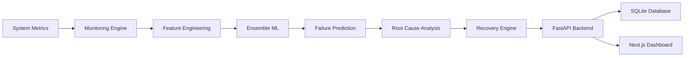
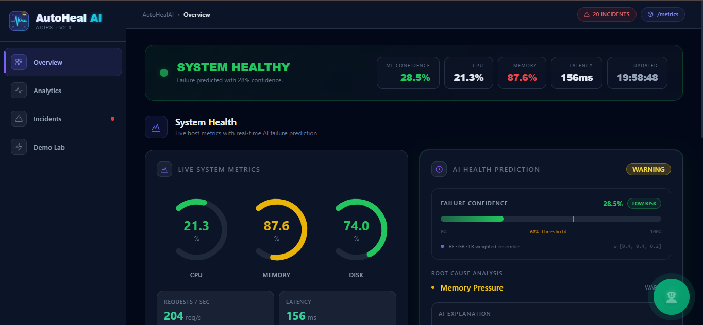

# AutoHealAI v2 — Enterprise AIOps Platform

AI-driven self-healing cloud monitoring. Predicts failures via ensemble ML,
explains root causes in plain English, recommends recovery actions, and displays
everything on a live dark-mode dashboard that refreshes every 3 seconds.

---
## Overview

AutoHealAI v2 is an AI-powered AIOps platform that continuously monitors cloud infrastructure, predicts failures before they occur using ensemble machine learning models, identifies probable root causes, recommends recovery actions, and visualizes everything through a real-time dashboard.

The system combines machine learning, explainable AI, FastAPI, Next.js, and system monitoring into an end-to-end self-healing infrastructure monitoring solution.
---

## Features

- Real-time infrastructure monitoring
- Predictive failure detection
- Ensemble ML models
- SHAP-based explainability
- Root cause analysis
- Automated recovery recommendations
- Live dashboard
- Incident management
- REST APIs
- SQLite data persistence
---

## Quick Start

### Windows (3 steps)
```
1. Double-click  setup.bat          ← installs everything, trains model
2. Double-click  start_backend.bat  ← Terminal 1: FastAPI on port 8000
3. Double-click  start_frontend.bat ← Terminal 2: Next.js on port 3000
```
Then open → http://localhost:3000

### Linux / macOS
```bash
cd autoheal_ai_v2
chmod +x setup.sh start.sh
./setup.sh      # installs deps, generates data, trains model
./start.sh      # starts both servers
```

---

## Manual Commands (any OS)

```bash
# Step 1 — Python deps
pip install -r requirements.txt

# Step 2 — Generate 7,000-row synthetic dataset
python simulation/data_generator.py

# Step 3 — Train ensemble (RF + GBM + LR), prints CV-AUC
python ml_models/train.py

# Step 4 — Start FastAPI backend   [Terminal 1]
uvicorn backend.main:app --host 0.0.0.0 --port 8000 --reload

# Step 5 — Start Next.js dashboard [Terminal 2]
cd frontend
npm install     # first time only
npm run dev
```

---

## Folder Structure

```
autoheal_ai_v2/
├── backend/
│   ├── main.py                  FastAPI app, CORS, lifespan startup
│   └── routes/
│       ├── metrics.py           GET /api/metrics/current|history
│       ├── predictions.py       GET /api/predictions/latest|history
│       └── alerts.py            GET/POST /api/alerts/incidents
├── ai_engine/
│   ├── predictor.py             Orchestrates full ML→cause→action→NL pipeline
│   ├── root_cause.py            Multi-condition threshold rule engine
│   ├── actions.py               Cause → priority-ranked action map
│   └── explainer.py             Natural language explanation generator
├── ml_models/
│   ├── train.py                 5-fold CV training, saves ensemble.pkl
│   ├── ensemble.py              Singleton model loader + weighted predict
│   ├── feature_engineering.py   Rolling-window features (train + inference)
│   └── model_store/             ensemble.pkl + training_report.json (auto-created)
├── monitoring/
│   ├── collector.py             Background thread: psutil + fault injection
│   └── buffer.py                Thread-safe circular ring buffer (200 items)
├── simulation/
│   └── data_generator.py        7,000-row synthetic dataset with 4 fault types
├── database/
│   └── store.py                 SQLite: metrics / predictions / incidents tables
├── utils/
│   ├── config.py                Central config (paths, thresholds, intervals)
│   └── logger.py                Structured logging → stdout + logs/autoheal.log
├── frontend/                    Next.js 14 + TypeScript + Tailwind + Recharts
│   └── src/
│       ├── app/                 page.tsx, layout.tsx, globals.css
│       ├── components/
│       │   ├── ui/              Card, Badge, Gauge, StatCard
│       │   ├── charts/          MetricsChart, ConfidenceGauge
│       │   └── panels/          HealthHeader, MetricsPanel, PredictionPanel,
│       │                        ActionsPanel, ChartsPanel, IncidentsPanel, ModelInfoPanel
│       ├── hooks/               useAutoHeal.ts — 3-second polling hook
│       ├── types/               TypeScript interfaces
│       └── lib/                 Utility functions
├── data/                        synthetic_metrics.csv (auto-created)
├── logs/                        autoheal.log (auto-created)
├── requirements.txt
├── setup.bat / start_backend.bat / start_frontend.bat   ← Windows
└── setup.sh  / start.sh                                 ← Linux/macOS
```

---

## API Reference

| Method | Endpoint | Description |
|--------|----------|-------------|
| GET | `/api/health` | Backend health + model status |
| GET | `/api/metrics/current` | Latest metric snapshot |
| GET | `/api/metrics/history?n=60` | Last N rows from SQLite |
| GET | `/api/predictions/latest` | Run inference on latest metrics |
| GET | `/api/predictions/history` | Last 10 stored predictions |
| GET | `/api/alerts/incidents?n=20` | All incidents |
| POST | `/api/alerts/incidents/{id}/acknowledge` | Ack an incident |

Interactive Swagger docs: **http://localhost:8000/docs**

---
## 🏗️ AutoHealAI Workflow


---

## ML Architecture

| Component | Detail |
|-----------|--------|
| Dataset | 7,000 synthetic rows, 4 injected fault types |
| Features | 15 total: 5 raw + 5 rolling-mean + 5 trend |
| Models | RandomForest (40%) + GradientBoosting (40%) + LogisticRegression (20%) |
| Validation | 5-fold stratified CV — AUC printed per model |
| Threshold | failure if weighted confidence > 60% |
| Explainability | RF feature importances + NL explanation per prediction |

---
## 🛠️ Tech Stack

### Backend


### Machine Learning


### Frontend


### Monitoring

---

## Dashboard Panels

| Panel | Description |
|-------|-------------|
| Status Banner | Live health with severity glow and confidence % |
| Metrics Panel | CPU/Memory/Disk gauges + 6 stat cards |
| AI Prediction | Confidence bar, root causes, NL explanation, per-model probas |
| Actions Panel | Priority-ranked automated/manual recovery actions |
| Charts Panel | CPU, Memory, Requests, Latency, Network area charts |
| Incidents | Timeline with ACK button, severity badges |
| Model Info | Per-model probabilities + feature importance bars |

---
## 🎥 Demo Video

[](docs/demo.mp4)

▶️ **Click the image above to watch the complete project demonstration.**
---

## Requirements

- Python 3.9+
- Node.js 18+
- ~200 MB disk (model + deps)
